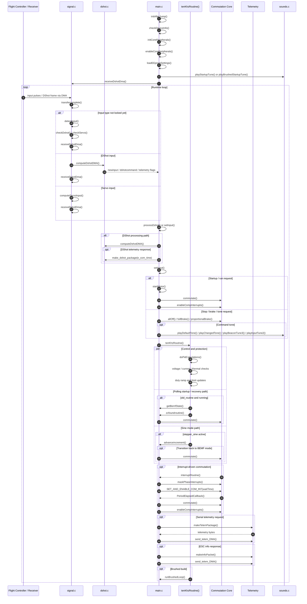

# AM32 Runtime Sequence Diagram

This document gives a high-level analysis of the AM32 firmware runtime flow and a sequence diagram for the main control path.

The core source modules involved are:

- `Src/main.c`: startup, control loop, commutation orchestration
- `Src/signal.c`: input detection and DMA input decoding
- `Src/dshot.c`: DShot frame decode and DShot telemetry packaging
- `Src/kiss_telemetry.c`: serial telemetry packet formatting
- `Src/functions.c`: utility helpers like `map()`, delays, and CRC
- `Src/sounds.c`: startup and status tones

## Project Analysis

AM32 is structured like a small real-time motor-control kernel around a few repeating responsibilities:

- input acquisition: DMA captures signal timing, then `signal.c` classifies and decodes it
- input normalization: `main.c` converts raw input into `adjusted_input`, manages arming, reverse, brake, and startup rules
- motor commutation: `main.c` uses either polling or interrupt-driven zero-cross detection to advance the motor phases
- protection and control: a high-frequency routine applies PID-based current limiting, stall protection, speed control, and voltage / thermal protection
- telemetry and UX: the firmware can package telemetry replies and play tones for startup, calibration, and commands

In practical terms, the runtime loop is:

1. initialize hardware and load persistent settings
2. capture incoming control signal
3. decode protocol and compute a usable input value
4. decide whether to arm, brake, start, or continue running
5. drive the commutation loop
6. periodically apply protection logic and send telemetry

## Sequence Diagram

## Notes

- `signal.c` is the entry point for incoming control data.
- `main.c` owns the system state machine and decides what the motor should do next.
- `tenKhzRoutine()` is the periodic control hub where protection and duty-cycle control are applied.
- commutation can happen in two modes:
  - polling mode during startup or recovery
  - interrupt-driven mode after zero-cross timing becomes stable
- telemetry is a side path and does not replace the main motor-control path.

## Related Documentation

- Detailed `main.c` call graph: [`doc/main-c-analysis.md`](C:\Users\user\Documents\Github\AM32\doc\main-c-analysis.md)
