# AM32 `main.c` Call Graph And Notes

This document summarizes the control flow and function relationships in [`Src/main.c`](C:\Users\user\Documents\Github\AM32\Src\main.c).

It focuses on:

- the detailed call graph for functions defined in `main.c`
- the caller-to-callee table for each `main.c` function
- the most important runtime paths through the firmware

## Main `main.c` Call Graph

```mermaid
flowchart TD
    M["main()"] --> CDI["checkDeviceInfo()"]
    M --> LEE["loadEEpromSettings()"]
    M --> SEE["saveEEpromSettings()"]
    M --> PST["playStartupTune() / playBrushedStartupTune()"]
    M --> RDD["receiveDshotDma()"]
    M --> SI["setInput()"]
    M --> PD["processDshot()"]
    M --> MT["makeTelemPackage()"]
    M --> MIP["makeInfoPacket()"]
    M --> GSC["getSmoothedCurrent()"]
    M --> GAD["getAbsDif()"]
    M --> RB["runBrushedLoop()"]
    M --> AI["advanceincrement()"]
    M --> ZC["zcfoundroutine()"]
    M --> COMM["commutate()"]

    PD --> CDD["computeDshotDMA()"]
    PD --> MDP["make_dshot_package()"]
    PD --> SI

    SI --> MAP["map()"]
    SI --> GAD
    SI --> SOM["startMotor()"]
    SI --> ABO["allOff() / fullBrake() / proportionalBrake() / maskPhaseInterrupts()"]
    SI --> SND["playDefaultTone() / playChangedTone() / playBeaconTune3() / playInputTune2()"]

    SOM --> COMM
    SOM --> ECI["enableCompInterrupts()"]

    COMM --> CST["comStep()"]
    COMM --> CCI["changeCompInput()"]

    PEC["PeriodElapsedCallback()"] --> COMM
    PEC --> ECI

    IR["interruptRoutine()"] --> MPI["maskPhaseInterrupts()"]
    IR --> SCI["SET_AND_ENABLE_COM_INT()"]

    TKR["tenKhzRoutine()"] --> GBS["getBemfState()"]
    TKR --> ZC
    TKR --> PID["doPidCalculations()"]
    TKR --> MAP
    TKR --> PIT["playInputTune()"]
    TKR --> DEL["delayMicros() / delayMillis()"]
    TKR --> GAD
    TKR --> CSP["comStep()"]
    TKR --> AI
    TKR --> COMM
    TKR --> GPE["generatePwmTimerEvent()"]
    TKR --> APO["allOff() / allpwm() / maskPhaseInterrupts() / fullBrake() / proportionalBrake()"]
    TKR --> ADC["ADC_DMA_Callback() / getConvertedDegrees() / getNTCDegrees()"]
    TKR --> MT
    TKR --> MIP
    TKR --> STD["send_telem_DMA()"]
    TKR --> GSC
    TKR --> RBL["runBrushedLoop()"]

    ZC --> COMM
    ZC --> ECI

    RB --> DEL
    RB --> MAP
    RB --> PID
    RB --> APO2["allOff() / twoChannelForward() / twoChannelReverse()"]

    LEE --> RFB["read_flash_bin()"]
    LEE --> MAP
    LEE --> SV["setVolume()"]

    SEE --> SFN["save_flash_nolib()"]

    classDef orchestration fill:#f4d35e,stroke:#7a5c00,color:#1f1f1f,stroke-width:2px;
    classDef control fill:#9ad1d4,stroke:#245c5f,color:#102a2b,stroke-width:2px;
    classDef commutation fill:#ee964b,stroke:#8a4513,color:#1f1f1f,stroke-width:2px;
    classDef telemetry fill:#c6d8af,stroke:#4b6b2c,color:#1d2b12,stroke-width:2px;
    classDef helper fill:#d9c2f0,stroke:#6b4c9a,color:#241533,stroke-width:2px;
    classDef io fill:#f7b2b7,stroke:#9d3d47,color:#351417,stroke-width:2px;

    class M,CDI,LEE,SEE orchestration;
    class SI,SOM,TKR,PID,MAP,GAD,GSC,RB,AI,PD control;
    class COMM,PEC,IR,ZC,GBS,ECI,CST,CCI,SCI commutation;
    class MT,MIP,STD,MDP telemetry;
    class PST,PIT,SND,SV,DEL helper;
    class RDD,CDD,RFB,SFN,ADC,ABO,APO,APO2,MPI,CSP io;
```

## Caller To Callee Table

| Function | Location | Calls |
|---|---:|---|
| `doPidCalculations(struct fastPID* pidnow, int actual, int target)` | `main.c:566` | No direct function calls |
| `loadEEpromSettings()` | `main.c:592` | `read_flash_bin()`, `setVolume()`, `map()` |
| `saveEEpromSettings()` | `main.c:781` | `save_flash_nolib()` |
| `getSmoothedCurrent()` | `main.c:786` | No direct function calls |
| `getBemfState()` | `main.c:799` | `getCompOutputLevel()` on non-`F031/G031` targets |
| `commutate()` | `main.c:836` | `comStep()`, `changeCompInput()` |
| `PeriodElapsedCallback()` | `main.c:878` | `commutate()`, `enableCompInterrupts()` |
| `interruptRoutine()` | `main.c:897` | `getCompOutputLevel()` on non-`F031/G031` targets, `maskPhaseInterrupts()` |
| `startMotor()` | `main.c:929` | `commutate()`, `enableCompInterrupts()` |
| `setInput()` | `main.c:940` | `map()`, `maskPhaseInterrupts()`, `allOff()`, `startMotor()`, `playDefaultTone()`, `playChangedTone()`, `playBeaconTune3()`, `playInputTune2()`, `getAbsDif()`, `fullBrake()`, `proportionalBrake()` |
| `tenKhzRoutine()` | `main.c:1307` | `delayMicros()`, `send_LED_RGB()` if enabled, `setIndividualRGBLed()` if enabled, `playInputTune()`, `delayMillis()`, `maskPhaseInterrupts()`, `getBemfState()`, `zcfoundroutine()`, `doPidCalculations()`, `map()`, `makeTelemPackage()`, `send_telem_DMA()`, `makeInfoPacket()`, `ADC_DMA_Callback()`, `getNTCDegrees()` or `getConvertedDegrees()` depending on target, `getSmoothedCurrent()`, `advanceincrement()`, `allpwm()`, `commutate()`, `generatePwmTimerEvent()`, `fullBrake()`, `proportionalBrake()`, `comStep()`, `allOff()`, `runBrushedLoop()`, `DroneCAN_update()` if enabled |
| `processDshot()` | `main.c:1504` | `computeDshotDMA()`, `make_dshot_package()`, `setInput()` |
| `advanceincrement()` | `main.c:1518` | `setPWMCompare1()`, `setPWMCompare2()`, `setPWMCompare3()` |
| `zcfoundroutine()` | `main.c:1561` | `commutate()`, `enableCompInterrupts()` |
| `runBrushedLoop()` | `main.c:1607` | `allOff()`, `delayMicros()`, `twoChannelForward()`, `twoChannelReverse()`, `map()`, `doPidCalculations()` |
| `checkDeviceInfo()` | `main.c:1669` | No direct function calls |
| `main()` | `main.c:1701` | `initAfterJump()`, `checkDeviceInfo()`, `initCorePeripherals()`, `enableCorePeripherals()`, `loadEEpromSettings()`, `saveEEpromSettings()`, `send_LED_RGB()` if enabled, `setIndividualRGBLed()` if enabled, `playStartupTune()`, `playBrushedStartupTune()`, `receiveDshotDma()`, `setInput()`, `processDshot()`, `map()`, `allOff()`, `resetInputCaptureTimer()`, `NVIC_SystemReset()`, `getAbsDif()`, `makeTelemPackage()`, `send_telem_DMA()`, `makeInfoPacket()`, `ADC_DMA_Callback()`, `getNTCDegrees()` or `getConvertedDegrees()`, `getSmoothedCurrent()`, `advanceincrement()`, `delayMicros()`, `commutate()`, `generatePwmTimerEvent()`, `fullBrake()`, `proportionalBrake()`, `comStep()`, `runBrushedLoop()`, `DroneCAN_update()` if enabled |
| `assert_failed(uint8_t* file, uint32_t line)` | `main.c:2270` | No direct function calls |

## Core Runtime Paths

### 1. Startup And Configuration

The startup path is:

`main()` -> `checkDeviceInfo()` -> `loadEEpromSettings()`

This stage:

- resolves EEPROM location from bootloader metadata
- loads persistent settings into `eepromBuffer`
- converts stored settings into runtime state like PWM limits, thresholds, direction, and protocol mode

### 2. Input To Motor Control

The most important motor-control path is:

`processDshot()` or direct loop input handling -> `setInput()` -> `startMotor()` -> `commutate()`

This is where the firmware:

- translates raw input into `adjusted_input`
- handles arming, reverse, braking, and sine-start decisions
- transitions into active commutation

### 3. Interrupt-Driven Commutation

The normal BLDC commutation loop is split across interrupt handlers:

`interruptRoutine()` -> timer wait -> `PeriodElapsedCallback()` -> `commutate()`

This path:

- detects a valid zero-cross event
- schedules the next commutation instant
- advances the active phase step

### 4. Polling-Mode Commutation

During startup or recovery, the firmware can use a polling-based path:

`tenKhzRoutine()` -> `getBemfState()` -> `zcfoundroutine()` -> `commutate()`

This path is used when comparator interrupt-based commutation is not yet stable enough.

### 5. Control Loop And Protection

`tenKhzRoutine()` is the main low-level control hub. It handles:

- current limiting through `doPidCalculations()`
- stall protection through `doPidCalculations()`
- speed control through `doPidCalculations()`
- telemetry trigger timing
- ADC processing and thermal / voltage protection
- sine-mode stepping and sine-to-BEMF transition

### 6. Telemetry And Side Effects

Telemetry is built mainly from the main loop:

- `makeTelemPackage()` for standard telemetry
- `makeInfoPacket()` for ESC info response
- `send_telem_DMA()` for transmission

The DShot reply path is:

`processDshot()` -> `make_dshot_package()`

### 7. Brushed Mode Branch

If brushed mode is compiled in, control can divert to:

`runBrushedLoop()`

This is a separate output strategy that reuses:

- `map()`
- `doPidCalculations()`
- current limiting logic

## Quick Summary

If you only remember a few functions in `main.c`, the highest-value ones are:

- `main()`: top-level orchestration
- `setInput()`: input normalization and motor state decisions
- `tenKhzRoutine()`: main control loop hub
- `commutate()`: motor phase transition core
- `interruptRoutine()` and `PeriodElapsedCallback()`: interrupt-based zero-cross commutation
- `zcfoundroutine()`: polling-based zero-cross commutation
- `processDshot()`: DShot bridge into the generic control path
